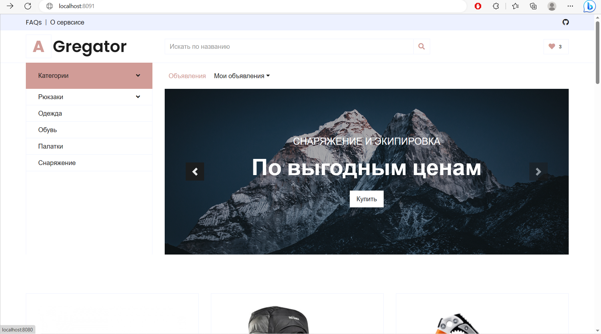

# Agregator
Java web mvc application for monitoring marketplaces. It checks avito-like stores and social media publics to put all the ads together. Application has convinient web
interface that allows users to search desirable products and filter them.

## Features
- User registration and login with JWT authentication
- Password encryption using BCrypt
- Role-based authorization with Spring Security
- Customized access denied handling
- Logout mechanism
- Avito parsing via Jsoup, finding announcements by cities and title
- Vk parsing via VkApi
- Removing ads posts while parsing Vk and automatically adding keywords
- Convenient ECommerce-like service with abilities to search specified product, add products to favorites, filter by price, date et c.
- Recently watched products
- Popular announcements
- Recommendation service based on users activity
- Users can place their own announcements
- Spring pagination&sorting
- Bean validation
- Using DTO layer

## Technologies
- Java 19
- Spring Boot 3
- JSON Web Tokens (JWT)
- BCrypt
- Spring Security
- Jsoup
- JUnit
- Hibernate
- PostgreSql
- Thymeleaf
- Maven
- Docker


## How to use (via docker)
Download .zip file with code, extract it, change directory to the root:
```bash
cd Agregator-master/Agregator-master
```
And create in root directory .env file with the following demo-credentials:
```text
PDB_UN=postgres
PDB_PW=sitis
```


Then run docker-compose.yml:
```bash
docker-compose up
```
Now application is available on **http://localhost:8091/**



## Contributing

Pull requests are welcome. For major changes, please open an issue first
to discuss what you would like to change.

Please make sure to update tests as appropriate.

